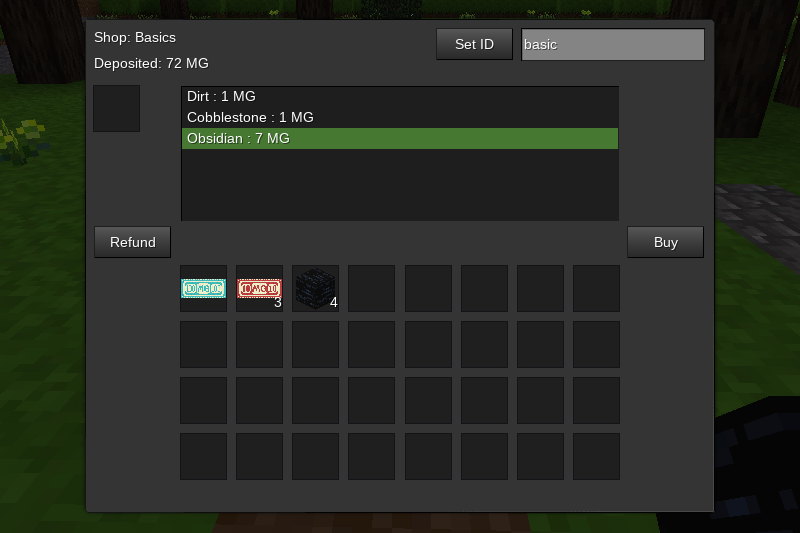

## Server Shop

### Description:

Shops intended to be set up by [Minetest](https://www.minetest.net/) server administrators.

No craft recipe is given as this for administrators, currently a machine can only be set up with `/giveme server_shop:shop` command.

***WARNING:** this mod is in early development, see [TODO](TODO.txt) list*



#### Usage:

Shop lists are registered with the `server_shop.register_shop(id, name, def)` function. `id` is a string identifier associated with the shop list. `name` is a human-readable string that will be displayed as the shop's title. `def` is the shop list definition. Shop lists are defined in a table of tuples in `{itemname, price}` format.

Registration example:
```
server_shop.register_shop("basic", "Basic Shop", {
	{
		{"default:wood", 2},
		{"default:obsidian", 7},
	}
})
```

Shops can optionally be registered in `<world_path>/server_shops.json` file. Example:

```json
[
  {
    "id":"frank",
    "name":"Frank's Shop",
    "sells":
    {"default:wood":1}
  },
  {
    "id":"julie",
    "name":"Julie's Shop",
    "sells":
    {
      "default:iron_lump":5,
      "default:copper_lump":5,
    }
  },
]
```

Server admins use the chat command `/giveme server_shop:shop` to receive a shop node. After placing the node, the ID can be set with the "Set ID" button & text input field (only players with the "server" privilege can set ID). Set the ID to the shop ID you want associated with this shop node ("basic" for the example above) & the list will be populated with the registered products & prices.

To make purchases, players deposit [minegeld notes][mod.currency] into the deposit slot. Select an item to purchase & press the "Buy" button. If there is adequate money deposited, player will receive the item & the price will be deducted from the deposited amount. Press the "Refund" button to retrieve any money not spent.

***SECURITY WARNING:*** As stated, this mod is in early development. Currently, it is possible to interfere in another player's transactions. So this mod is *not* recommended for use with public servers at this time.

### Licensing:

- Code: [MIT](LICENSE.txt)
- Textures: CC0

### Dependencies:

- Required:
  - [currency][mod.currency]
- Optional:
  - none

Compatible with:

### Links:

- [GitHub repo](https://github.com/AntumMT/mod-server_shop)
- [Minetest forum](https://forum.minetest.net/viewtopic.php?t=26645)
- [Changelog](CHANGES.txt)
- [TODO](TODO.txt)


[mod.currency]: https://forum.minetest.net/viewtopic.php?t=21339
