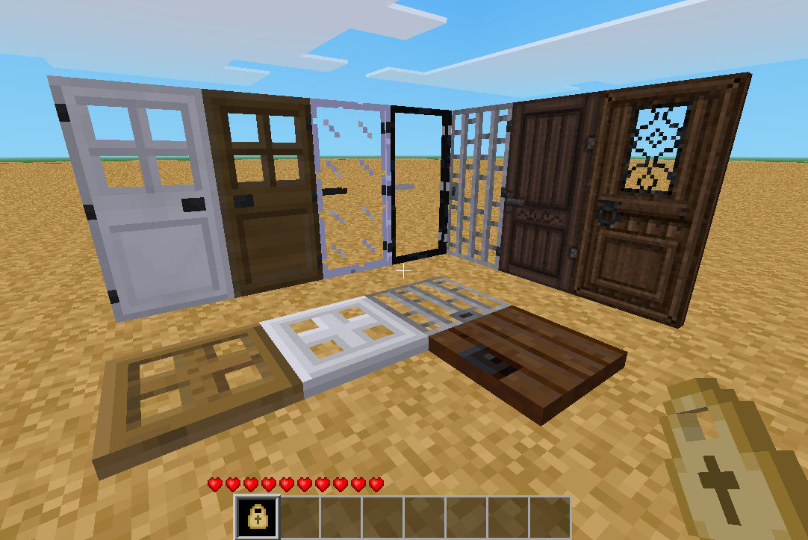

minetest mod Doors Redo
=========================

Information
-----------

This mod replaces the default `doors` mod and adds a new tool that can flip
between (open, locked, protected) states of any door or trapdoor.  Master keys
can still be used to give players access to your locked doors.

Tech information
----------------

#### Door States

* OPEN - This is like default Doors mod, can be opened by any player or dug up.
* OWNED - This locks the door so that only the owner can open or dig the door.
* PROTECTED - This locks the door but based on protected area the door sits inside.

Note: A protection mod must be installed to use Protected mode so that it works
properly, not having one running will mean all protected doors will open for
anyone who uses them.

#### Dependencies

* default

Optional dependences:

* screwdriver
* protector

#### Mesecons Support

Each door has mesecons support baked in so that switches and pressure plates can open
doors, trapdoors and fence gates.  Please disable 'mesecons_doors' mod so that it works
properly.

#### Nodes

| Node name               | Description name      |
| ----------------------- | --------------------- |
| doors:hidden            | Hidden Door Segment   |
| doors:trapdoor          | Trapdoor              |
| doors:trapdoor_steel    | Steel Trapdoor        |
| doors:trapdoor_oak      | Oak Trapdoor          |
| doors:door_steel        | Steel Door            |
| doors:door_glass        | Glass Door            |
| doors:door_obsidian_glass | Obsidian Glass Door |
| doors:door_phiwari      | Phiwari's Wooden Door |
| doors:door_iceage       | IceAge's Wooden Door  |
| doors:gate_wood         | Wooden Fence Gate     |
| doors:gate_acacia_wood  | Acacia Fence Gate     |
| doors:gate_junglewood   | Junglewood Fence Gate |
| doors:gate_pine_wood    | Pine Fence Gate       |
| doors:gate_aspen_wood   | Aspen Fence Gate      |

#### Items tools

The lock tool can be crafted (top middle is 1x gold ingot, 4x steel ingots either side of
middle and bottom rows).  When held in players hand you can punch a door to flip between
each state to open, lock (own) and protect the door.

| Node item             | Description name      |
| --------------------- | --------------------- |
| doors:lock_tool       | Lock Tool             |

License
-------

#### Authors of source code

Originally by PilzAdam (MIT)

Modified by BlockMen (MIT): Added sounds, glass doors (glass, obsidian glass) and trapdoor.

Modified by sofar (sofar@foo-projects.org) (MIT):
Added Steel trapdoor.
Re-implemented most of the door algorithms, added meshes, UV wrapped texture.
Added doors API to facilitate coding mods accessing and operating doors.
Added Fence Gate model, code, and sounds.

Various Minetest developers and contributors (MIT)

Finally featured by TenPlus1

#### Authors of media (textures)

Following textures created by Fernando Zapata (CC BY-SA 3.0):
  door_wood.png
  door_wood_a.png
  door_wood_a_r.png
  door_wood_b.png
  door_wood_b_r.png

Following textures created by BlockMen (CC BY-SA 3.0):
  door_trapdoor.png
  door_obsidian_glass_side.png

Following textures created by sorcerykid (CC BY-SA 3.0):
  door_trapdoor_oak.png
  door_trapdoor_oak_side.png

Following textures created by celeron55 (CC BY-SA 3.0):
  door_glass_a.png
  door_glass_b.png

Following textures created by PenguinDad (CC BY-SA 4.0):
  door_glass.png
  door_obsidian_glass.png

Following textures created by sofar (CC-BY-SA-3.0):
  doors_trapdoor_steel.png

Following textures created by paramat (CC-BY-SA-3.0):
  door_trapdoor_side.png
  doors_trapdoor_steel_side.png

Obsidian door textures by red-001 based on textures by Pilzadam and BlockMen (CC BY-SA 3.0):
  door_obsidian_glass.png

Glass door textures by Krock and paramat based on textures by VanessaE (CC BY-SA 3.0):
  doors_door_glass.png
  doors_item_glass.png

TenPlus1 (CC-BY-SA-3.0):
  doors_lock_tool.png

All other textures (created by PilzAdam) (CC BY-SA 3.0):

Door textures were converted to the new texture map by sofar, paramat and
red-001, under the same license as the originals.

#### Authors of media (models)

Door 3d models by sofar (CC-BY-SA-3.0)
 - door_a.obj
 - door_b.obj
Fence gate models by sofar (CC-BY-SA-3.0)
 - fencegate_open.obj
 - fencegate_closed.obj

#### Authors of media (sounds)

Opening-Sound created by CGEffex (CC BY 3.0), modified by BlockMen
  door_open.ogg
Closing-Sound created by bennstir (CC BY 3.0)
  door_close.ogg
fencegate_open.ogg:
  http://www.freesound.org/people/mhtaylor67/sounds/126041/ - (CC0 1.0)
fencegate_close.ogg:
  http://www.freesound.org/people/BarkersPinhead/sounds/274807/ - (CC-BY-3.0)
  http://www.freesound.org/people/rivernile7/sounds/249573/ - (CC-BY-3.0)
Steel door sounds open & close (CC-BY-3.0) by HazMatt
  - http://www.freesound.org/people/HazMattt/sounds/187283/
  doors_steel_door_open.ogg
  doors_steel_door_close.ogg
doors_glass_door_open.ogg, doors_glass_door_close.ogg:
  https://www.freesound.org/people/SkeetMasterFunk69/sounds/235546/ (CC0 1.0)

Check [license.txt](license.txt)
