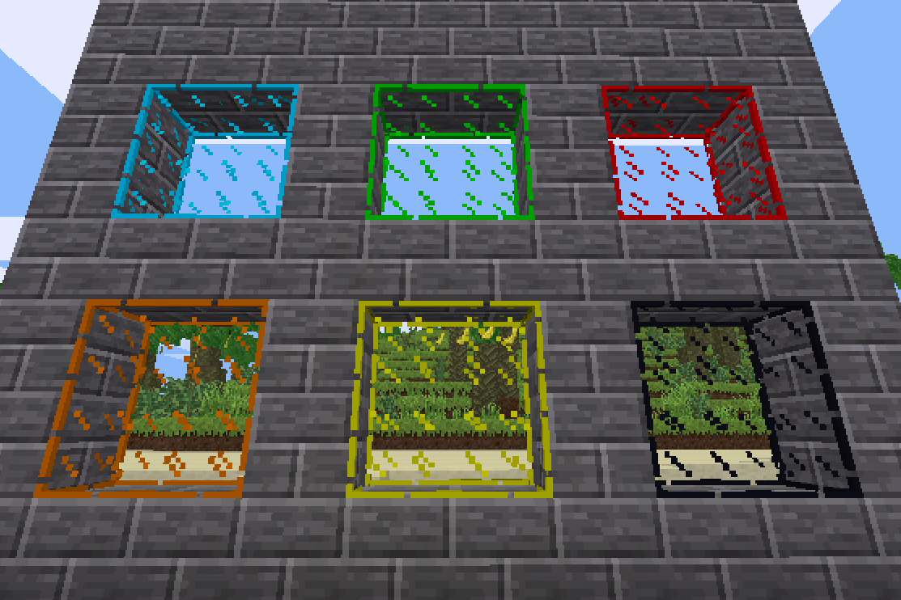

## Glass Mod for Minetest

---
### Description:

[Minetest][] mod that makes [default glass nodes][default] colorable.

***NOTE:*** *This mod is a **work-in-progress**. Not all glass node types have been added.*

--------------
### Licensing:

- [MIT](LICENSE.txt)

-----------------
### Dependencies:

Required:
- [default][]
- [unifieddyes][]

----------
### Links:

- [Forum](https://forum.minetest.net/viewtopic.php?t=18307)
- [Git repo](https://github.com/AntumMT/mod-glass)
- [Changelog](changelog.txt)
- [TODO](TODO.txt)

[Minetest]: http://www.minetest.net/

[default]: https://github.com/minetest/minetest_game/blob/master/mods/default
[unifieddyes]: https://forum.minetest.net/viewtopic.php?t=2178
