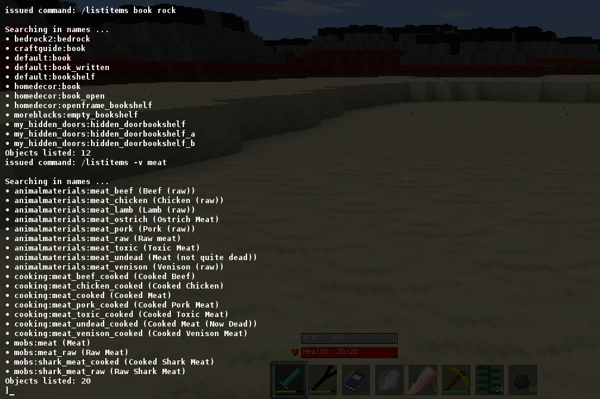

# ***listitems*** chat command for Minetest

### Description

- A very basic chat command to list all registered craft items available in the game.
- Invocation: */listitems [string1] [string2] ...*
  - Without any parameters, all items registered in game are listed.
  - With parameters, only items matching any of the strings will be listed.

### Licensing

- MIT (see [LICENSE.txt](LICENSE.txt))

### Requirements

- Depends: none
- Privileges: none
