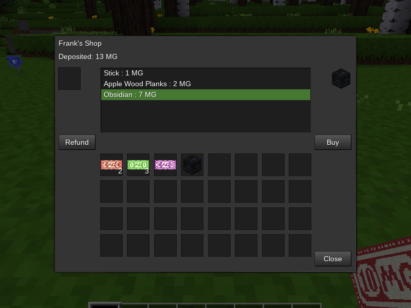

## Server Shops

### Description:

Shops intended to be set up by [Minetest](https://www.minetest.net/) server administrators.

No craft recipe is given as this for administrators, currently a shop can only be set up with the `/giveme` command. The two shop nodes are `server_shop:shop_small` & `server_shop:shop_large` (they function identically).



### Usage:

#### Registering Shops:

There are two types of shops, seller & buyer. A seller shop can be registered with `server_shop.register_seller(id, name, products)`. A buyer with `server_shop.register_buyer(id, name, products)`. `id` is a string identifier associated with the shop list. `name` is a human-readable string that will be displayed as the shop's title. `products` is the shop list definition. Shop lists are defined in a table of tuples in `{itemname, value}` format. `itemname` is the technical string name of an item (e.g. `default:wood`). `value` is the number representation of what the item is worth.

*Example:*
```lua
-- register seller
server_shop.register_seller("frank", "Frank's Shop", {{"default:wood", 2}})

-- register buyer
server_shop.register_buyer("julie", "Julie's Shop",  {
	{"default:copper_lump", 5},
	{"default:iron_lump", 6},
})
```

Shops can optionally be configured in `<world_path>/server_shops.json` file. To register a shop, set `type` to "sell" or "buy". `id` is a string identifier for the shop. `name` is the string displayed in the formspec & when a player points at the node. `products` is an array of products sold at the shop in format "name,value".

*Example:*
```json
[
  {
    "type":"sell",
    "id":"frank",
    "name":"Frank's Shop",
    "products":[["default:wood",2]]
  },
  {
    "type":"buy",
    "id":"julie",
    "name":"Julie's Shop",
    "products":
    [
      ["default:copper_lump",5],
      ["default:iron_lump",6],
    ]
  },
]
```

#### Registering Currencies:

Currencies can be registered with `server_shop.register_currency`:
```lua
server_shop.register_currency("currency:minegeld", 1)
server_shop.register_currency("currency:minegeld_5", 5)
```

When registering new currencies in `server_shops.json`, set `type` to "currencies". `value` is a table of item names & worth:
```json
	{
		"type":"currencies",
		"value":
		{
			"currency:minegeld":1,
			"currency:minegeld_5":5,
		},
	},
```

You can also register a currency suffix to be displayed in the formspec. Simply set the string value of `server_shop.currency_suffix`:

```lua
server_shop.currency_suffix = "MG"
```

In `server_shops.json`, set `type` to "suffix" & `value` to the string to be displayed:
```json
	{
		"type":"suffix",
		"value":"MG",
	},
```

By default, if the [currency][mod.currency] mod is installed, the minegeld notes will be registered as currency. This can be disabled by setting `server_shop.use_currency_defaults` to `false` in `minetest.conf`.

#### Setting up Shops in Game:

Server admins use the chat command `/giveme server_shop:shop_small` or `/giveme server_shop:shop_large` to receive a shop node. After placing the node, the ID can be set with the "Set ID" button & text input field (only players with the "server" privilege can set ID). Set the ID to the registered shop ID you want associated with this node ("frank" or "julie" for the examples above) & the list will be populated with the registered products & prices.

#### Using Seller Shops:

To make purchases, player first deposits registered currency items into the deposit slot. Select an item in the products list & press the "Buy" button. If there is adequate money deposited, player will receive the item & the cost will be deducted from the deposited amount. To retrieve any money not spent, press the "Refund" button. If the formspec is closed while there is still a deposit balance, the remaining money will be refunded back to the player. If there is not room in the player's inventory, the remaining balance will be dropped on the ground.

#### Using Buyer Shops:

For buyer shops, the product list shows what items can be sold to this shop & how much money a player will receive for each item. To sell to the shop, place an item in the deposit slot. The slot will only accept items that the owner will purchase. Press the "Sell" button to recieve the value of the item(s).

### Licensing:

- Code: [MIT](LICENSE.txt)
- Textures: CC0

### Dependencies:

- Required:
  - none
- Optional:
  - [currency][mod.currency]

### Links:

- [](https://content.minetest.net/packages/AntumDeluge/server_shop/)
- [GitHub repo](https://github.com/AntumMT/mod-server_shop)
- [Forum](https://forum.minetest.net/viewtopic.php?t=26645)
- [Reference](https://antummt.github.io/mod-server_shop/reference/latest/)
- [Changelog](changelog.txt)
- [TODO](TODO.txt)


[mod.currency]: https://content.minetest.net/packages/VanessaE/currency/
