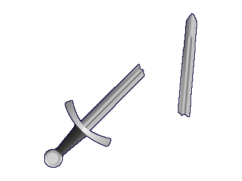

## Equipment Wear

### Description:

A [Minetest](https://www.minetest.net/) mod that allows tool & equipment wear to be disabled. Supports tools (pick, axe, shovel, etc.), weapons, & armor.

Armor mods supported:
- [](https://content.minetest.net/packages/stu/3d_armor/)



### Licensing:

- Code: [MIT](LICENSE.txt)
- Icon: [CC0](https://openclipart.org/detail/169233)

### Usage:

#### Settings:

```
tool_wear
- Enables/Disables wear for tools such as picks, axes, shovels, etc.
- type:    bool
- default: true

weapon_wear
- Enables/Disables wear for weapons.
- type:    bool
- default: true

armor_wear
- Enables/Disables wear for armor.
- type:    bool
- default: true
```

### Links:

- [](https://content.minetest.net/packages/AntumDeluge/equip_wear/)
- [Forum](https://forum.minetest.net/viewtopic.php?t=27019)
- [Git repo](https://github.com/AntumMT/mod-equip_wear)
- [Changelog](changelog.txt)
- [TODO](TODO.txt)
