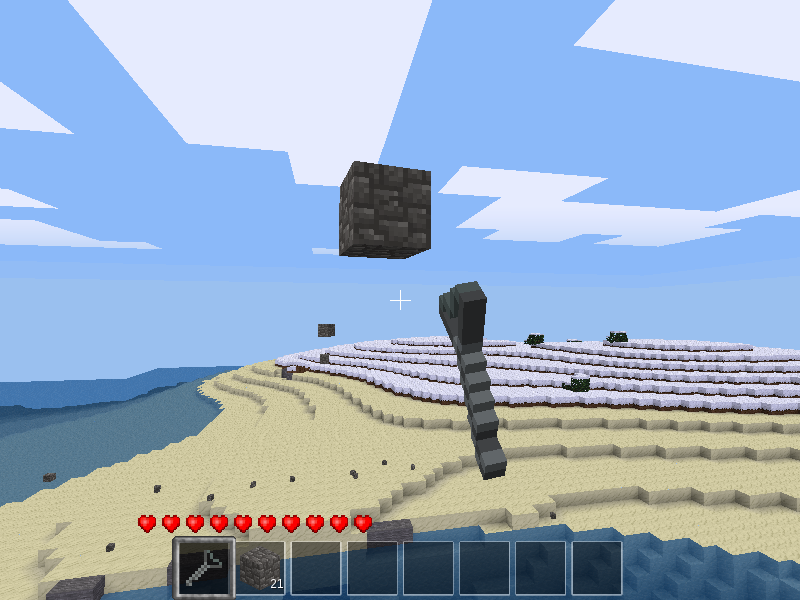

# Slingshot Mod for Minetest

### Description:

Adds a slingshot that can throw inventory items as ammunition

Depends:
- default

### Licensing:

- Original code by [AiTechEye][]: [CC0][lic.cc0]
- Code by Jordan Irwin: [MIT][lic.mit]

### Functions:

- *Right-click*: Changes ammo slot between left & right of slingshot
- *Left-click*: Throws items from selected ammo slot

### Crafting:

* `SI` = default:steel_ingot
* `ST` = default:stick

##### Craft recipes:

slingshot:

    ╔════╦════╦════╗
    ║ SI ║    ║ SI ║
    ╠════╬════╬════╣
    ║    ║ SI ║    ║
    ╠════╬════╬════╣
    ║    ║ SI ║    ║
    ╚════╩════╩════╝

wood slingshot:

    ╔════╦════╦════╗
    ║ ST ║    ║ ST ║
    ╠════╬════╬════╣
    ║    ║ ST ║    ║
    ╠════╬════╬════╣
    ║    ║ ST ║    ║
    ╚════╩════╩════╝

[AiTechEye]: https://forum.minetest.net/memberlist.php?mode=viewprofile&u=16172

[lic.cc0]: LICENSE-cc0.txt
[lic.mit]: LICENSE.txt
