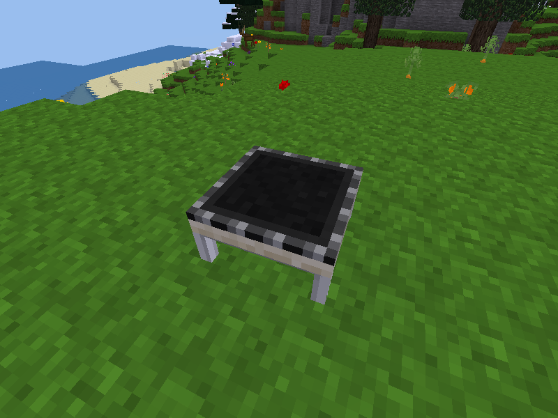

# Trampoline

Forked from [Jeija's jumping mod](https://forum.minetest.net/viewtopic.php?t=2957) @ [Git commit 47df671](https://github.com/Jeija/minetest-mod-jumping/tree/47df671545c55f446d1b2cd08d39a8ded40475d5).




### Licensing:

- Code: [GPLv3](LICENSE.txt)
- Textures: CC0
- Sounds: [CC0](docs/sources_sounds.txt)


### Dependencies:

- Required:
  - none
- Optional:
  - [default][mod.default] (required for craft recipe)
  - [technic][mod.technic] (required for craft recipe)
  - [unifieddyes][mod.unifieddyes] (required for coloring)


### Crafting:

<details>
<summary>Spoiler:</summary>

Key:
- TR = technic:rubber
- GW = group:wood
- GS = group:stick


Craft recipe:
```
    ╔════╦════╦════╗
    ║ TR ║ TR ║ TR ║
    ╠════╬════╬════╣
    ║ GW ║ GW ║ GW ║
    ╠════╬════╬════╣
    ║ GS ║    ║ GS ║
    ╚════╩════╩════╝
```

</details>


### Links:

- [Minetest forum](https://forum.minetest.net/viewtopic.php?t=17691)
- [Git repo](https://github.com/AntumMT/mod-trampoline)
- [Changelog](CHANGES.txt)
- [TODO](TODO.txt)


[mod.default]: https://github.com/minetest/minetest_game/tree/master/mods/default
[mod.technic]: https://forum.minetest.net/viewtopic.php?t=2538
[mod.unifieddyes]: https://forum.minetest.net/viewtopic.php?t=2178
