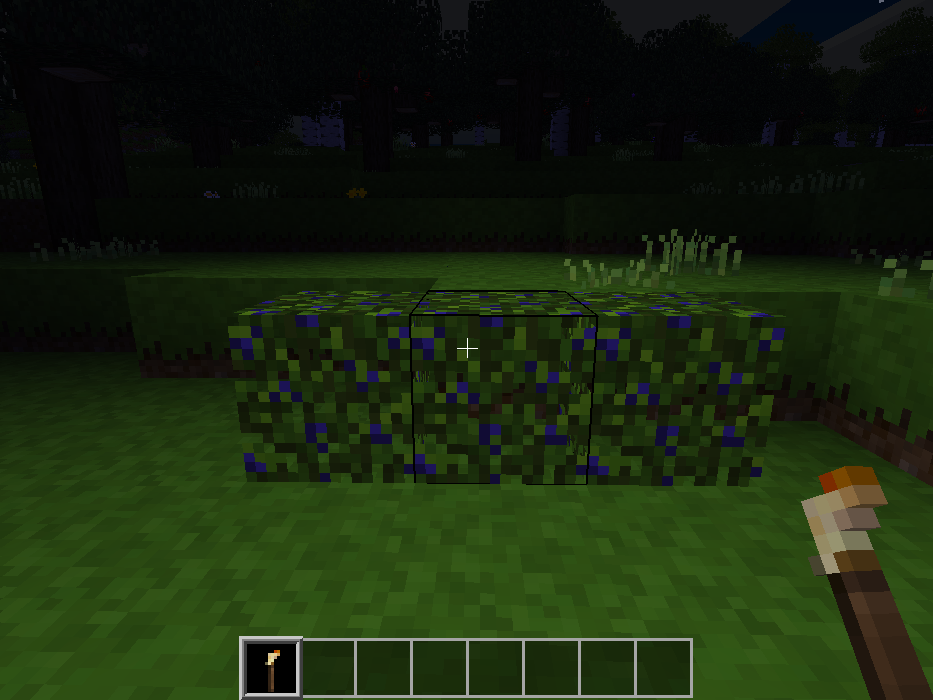

## Walking Light

### Description:

A mod for [Minetest][] that illuminates the area around a player when equipped with a light item.

#### History:

- forked from [v0.6][forum] of Echo's walking_light
- forked from [Git commit 766ef0f](https://github.com/petermaloney/walking_light/tree/766ef0f) of petermaloney's walking_light

### Licensing:

- Code: [MIT](LICENSE.txt)
- Textures: [CC0](https://creativecommons.org/publicdomain/zero/1.0/legalcode)

### Requirements:

- Minetest minimum version: 5.0.0
- Depends: none
- Optional depends: default (for torch & megatorch)

### Links:

- [Forum][forum]
- [Git repo](https://github.com/AntumMT/mod-walking_light)
- [API](https://antummt.github.io/mod-walking_light/docs/api.html)
- [Changelog](changelog.txt)
- [TODO](TODO.txt)

[Minetest]: http://minetest.net/
[forum]: https://forum.minetest.net/viewtopic.php?t=2621
