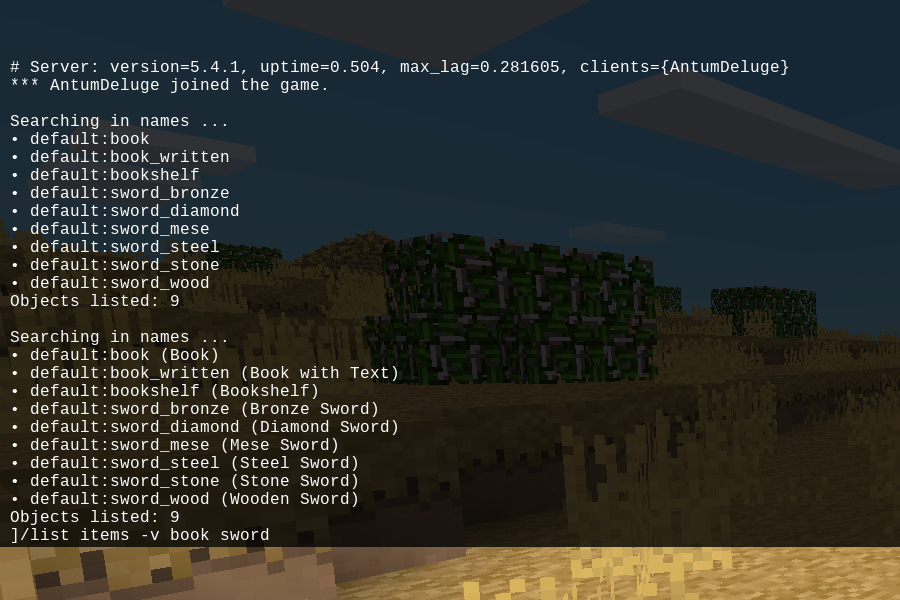

## List Items chat command for Minetest

### Description:

A mod for [Minetest][] that adds a command for listing registered items, entities, & nodes.



### Usage:

Chat Commands:
```
/list type [options] [string1] [string2] ...
- Lists registered items or entities available in the game.
- type: List type (e.g. "items", "entities", etc.).
- options: Switches to control output behavior.
    - -v: Display description (if available) after object name.
    - -s: Use shallow search (don't search in descriptions).
- string[1,2] ...: String parameter(s) to filter output.
    - Without any string parameters, all objects registered in game are listed.
    - With string parameters, only objects matching any of the strings will be listed.
```

Settings:
```
listitems.bullet_list
- Displays items in a bulleted list.
- type: boolean
- default: true

listitems.enable_singleword
- Registers "/list<type>" commands (e.g. "/listitems", "/listentities", etc.).
- type: boolean
- default: true
```

### Licensing:

- [MIT](LICENSE.txt)

### Requirements:

- Minetest minimum version: 5.0
- Dependencies: none
- Optional depends:
	- [mobs_redo][] *(adds "list mobs" chat command)*
- Privileges: none

### Links:

- [API Documentation](https://antummt.github.io/mod-listitems/docs/)
- [Changelog](changelog.txt)
- [TODO](TODO.txt)


[Minetest]: http://www.minetest.net/
[mobs_redo]: https://forum.minetest.net/viewtopic.php?t=9917
