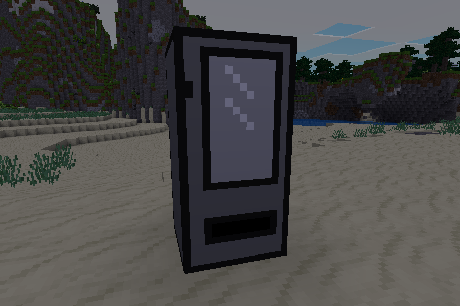
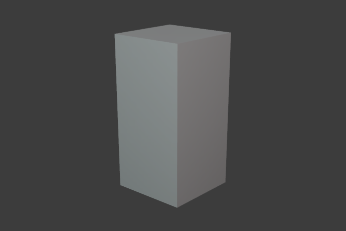
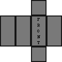

## Simple Models

### Description

A set (currently only one) of very simple models for [Minetest](https://www.minetest.net/).

#### Models

- [node_1x2x1](https://opengameart.org/node/129635)
	- for nodes with dimensions 1x2x1

 

### Licensing

- [Creative Commons Zero (CC0) 1.0](https://creativecommons.org/publicdomain/zero/1.0/)

### Links

- 
- [Forum](https://forum.minetest.net/viewtopic.php?t=27177)
- [Git repo](https://github.com/AntumMT/mod-simple_models)
