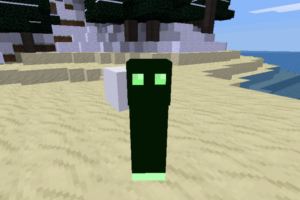

## Sneeker mod for Minetest

### Description:

An explosive nuisance for [Minetest](http://minetest.net/).

### Licensing:

- Code: [MIT](LICENSE.txt)
  - Original by Rui: WTFPL
- tnt_function code: [MIT](tnt_function.lua)

### Usage:

Settings documented in [reference][].

### Requirements:

- Depends: default, tnt
- Optional depends: nether, sounds, simple_protection

### Links:

- 
- [Forum thread](https://forum.minetest.net/viewtopic.php?t=26685)
- [Git repo](https://github.com/AntumMT/mod-sneeker)
- [Reference][reference]
- [Changelog](changelog.txt)
- [TODO](TODO.txt)

Rui's original mod:

- Forum thread (deleted: `t=11891`)
- [Final version](https://github.com/AntumMT/mod-sneeker/releases/tag/Rui)
- [Updated for Minetest 5.x](https://github.com/AntumMT/mod-sneeker/releases/tag/5.x)

[reference]: https://antummt.github.io/mod-sneeker/docs/reference/
