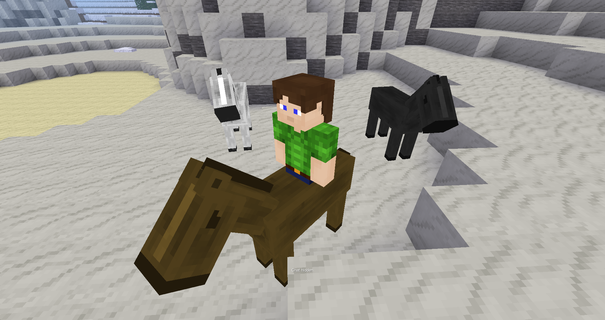

## Horses for Luanti

### Description:

A continuation of the [whinny][forum] mod for [Luanti (Minetest)](https://luanti.org/), that adds tameable & rideable horses.

### Licensing:

- Code: [MIT](LICENSE.txt)
- Models & textures by sparky: CC0

### Usage:

Wild horses can be tamed by feeding them items that they like, such as apples, carrots, wheat, & oats. Once the horse's appetite has been satisfied it becomes "tamed" & the player feeding it becomes the owner. Tamed/Owned horses can only be ridden, picked up, & killed by the owner. A single item can be specified using the setting `whinny.pickup_with` to pick up & place horse in inventory. The default is `mobs:lasso`.

To ride tamed horsed, right-click (place action) the entity to mount it. Use the W/S keys for forward/reverse. There are two modes for steering:

- mouse (follows player facing direction) (default)
- A/D keys

Controls can be changed by setting `mount_turn_player_look` in the configuration.

Right-click again to dismount. Tamed horses do not wander.

### Dependencies:

Optional:
- [default](https://github.com/minetest-game/default)
- [mobs_redo](https://content.luanti.org/packages/TenPlus1/mobs/) (meat drops)
- [farming](https://github.com/minetest-game/farming) or [farming_redo](https://content.luanti.org/packages/TenPlus1/farming/)
- [player_api](https://github.com/minetest-game/player_api)
- [sounds](https://content.luanti.org/packages/AntumDeluge/sounds/)

### Links:

- [Forum][forum]
- [Git repo](https://codeberg.org/AntumLuanti/mod-whinny)
- [Changelog](changelog.txt)
- [TODO](TODO.txt)

[forum]: https://forum.luanti.org/viewtopic.php?t=17170
