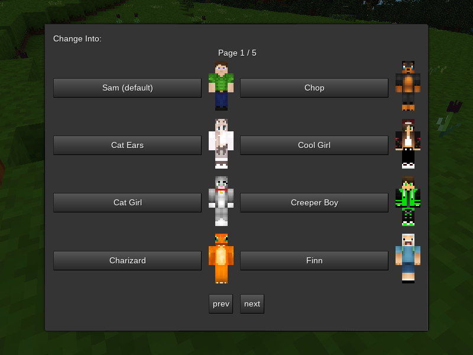

## Wardrobe mod for Minetest

### Description:

Forked from [prestidigitator's wardrobe mod](https://forum.minetest.net/viewtopic.php?t=9680).

Provides a simple way to change skins on the default character mesh.



### Usage:

Changing skins is done via a "wardrobe" node, which brings up a form with skin names when you right-click on it. Choosing a skin instantly changes your character's appearance, and this change is kept if you log out.

#### Registering skins:

There are two ways to register skins:

1. adding the filenames to *skins.txt* located in this mod's directory or the world path (see "Skins file syntax" below)
2. using the *wardrobe.registerSkin* method:

`wardrobe.registerSkin(texture, displayname)`

- *texture:* real filename of texture (e.g. "my_skin.png")
- *displayname:* text shown to player (e.g. "My Skin")

Minetest recognizes skins located in a mod's *textures* sub-directory (e.g. *&lt;mod_path&gt;/textures*), *&lt;minetest_install&gt;/textures*, & textures installed to the current user's home directory:

- on Linux/Unix-like systems, this is *~/.minetest/textures*
- on Windows, this is *%AppData%/Minetest/textures* (only if built with *-DRUN_IN_PLACE=FALSE* flag)

#### Skins file syntax:

A comment line starts with two dashes (like in Lua), but must be the only thing on the line:

> `-- This is a comment and has no effect.`

Except for empty lines and comments, each line names a texture (file) and a name, separated by optional whitespace and a colon (:):

> `texture_file_name.png: My Skin`
> `skin_other_texture_file_name.png: Other Skin`

The first string (e.g. "texture_file_name.png") will be passed to the Minetest API just like any other node or item texture. Generally it is simply the whole file name of an image in a mod "texture" directory or texture pack. The second string (e.g. "My Skin") is presented to the player in-world as the name of the texture. If this name is omitted, as in:

> `texture_file_name.png`
> `skin_other_texture_file_name.png`

Then a name is constructed by removing any ".png" suffix any optional "skin_" or "wardrobe_skin_" prefix, and replacing underscores with spaces. So the above skins would be named "texture file name" and "other texture file name", respectively.

To remove a skin that was added elsewhere (for example, to remove a skin in a particular world), prepend a minus sign (-) to the line:

> `-skin_other_texture_file_name.png`

This would remove the "skin_other_texture_file_name.png" skin no matter where it was specified or what name it was given.

#### Settings:

```
wardrobe.skins_per_page
  - determines how many skins are shown on each page
  - type:    int
  - min:     1
  - max:     8
  - default: 8

wardrobe.previews
  - determines if preview images are shown in form
  - type:    bool
  - default: true
```

#### Crafting:

<details><summary>Spoiler:</summary>

Key:
```
GW: any wood planks
GS: any stick
GL: any wool
```

Wardrobe node:
```
╔════╦════╦════╗
║ GW ║ GS ║ GW ║
╠════╬════╬════╣
║ GW ║ GL ║ GW ║
╠════╬════╬════╣
║ GW ║ GL ║ GW ║
╚════╩════╩════╝
```

</details>

### Licensing:

- Code: [MIT](LICENSE.txt)
- Textures by prestidigitator: CC0
- *character-preview.png* created from [player_api](https://github.com/minetest/minetest_game/blob/master/mods/player_api/models/character.png): ([CC BY-SA 3.0](https://github.com/minetest/minetest_game/blob/master/mods/player_api/license.txt))

### Requirements:

- Minetest v0.5.0
- Depends: [default](https://github.com/minetest/minetest_game/tree/master/mods/default), [player_api](https://github.com/minetest/minetest_game/tree/master/mods/player_api)
- Optional depends: [wool](https://github.com/minetest/minetest_game/tree/master/mods/wool) (craft recipe)

### Links:

- [Git Repo](https://github.com/AntumMT/mod-wardrobe)
- [Changelog](changelog.txt)
- [TODO](TODO.txt)
