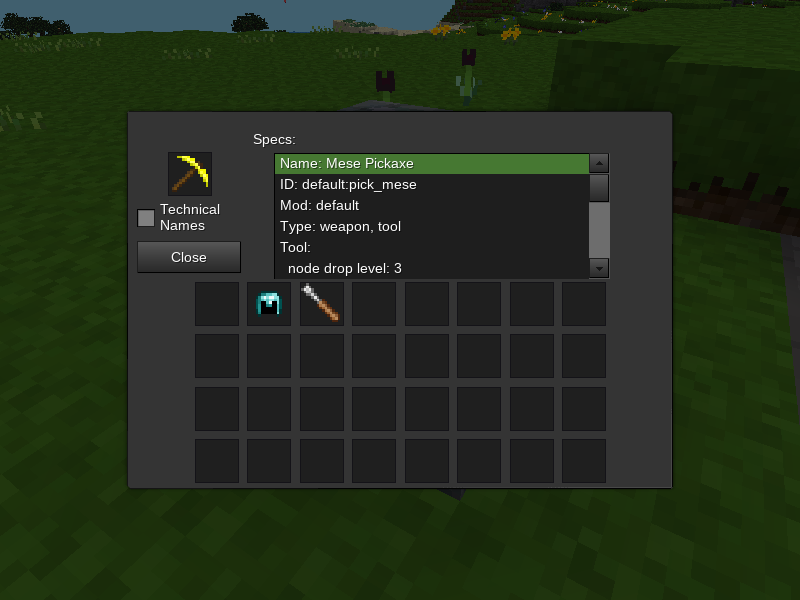

## Equipment Examiner

### Description:

A [Minetest](https://www.minetest.net/) mod that adds a node that can be used to examine equipment & item specs.



### Licensing:

- Code: [MIT](LICENSE.txt)
- Textures: [CC0](textures//sources.txt)

### Usage:

Right-click the equipment examiner node & place an item into its inventory slot to populate the specs list.

### Requirements:

- Minetest minimum version: 5.0
- Depends: none
- Optional depends:
	- [](https://github.com/minetest/minetest_game/tree/master/mods/default) *(required for craft recipe)*
	- [](https://content.minetest.net/packages/VanessaE/basic_materials/)
	- [](https://content.minetest.net/packages/bell07/wielded_light/)
	- [](https://github.com/AntumMT/mod-workbench)
	- [](https://content.minetest.net/packages/jp/xdecor/)
	- [](https://content.minetest.net/packages/AntumDeluge/3d_armor_light/)

#### Other Mod Support:

- [](https://content.minetest.net/packages/stu/3d_armor/)

### Crafting:

<details>
<summary>Spoiler:</summary>

Key:
- d:s = default:steel_ingot (wrought iron ingot)
- d:b = default:bronze_ingot (bronze ingot)
- d:o = default:obsidianbrick (obsidian brick)
- b:i = basic_materials:ic (simple integrated circuit)

<blockquote>

Without `basic_materials`:
```
┌─────┬─────┬─────┐
│ d:s │ d:b │ d:s │
├─────┼─────┼─────┤
│ d:b │ d:o │ d:b │
├─────┼─────┼─────┤
│ d:s │ d:b │ d:s │
└─────┴─────┴─────┘
```

With `basic_materials`:
```
┌─────┬─────┬─────┐
│ d:s │ d:b │ d:s │
├─────┼─────┼─────┤
│ d:b │ b:i │ d:b │
├─────┼─────┼─────┤
│ d:s │ d:b │ d:s │
└─────┴─────┴─────┘
```

</blockquote>
</details>

### Links:

- [](https://content.minetest.net/packages/AntumDeluge/equip_exam/)
- [Forum](https://forum.minetest.net/viewtopic.php?t=26618)
- [Git repo](https://github.com/AntumMT/mod-equip_exam)
- [Changelog](changelog.txt)
- [TODO](TODO.txt)
