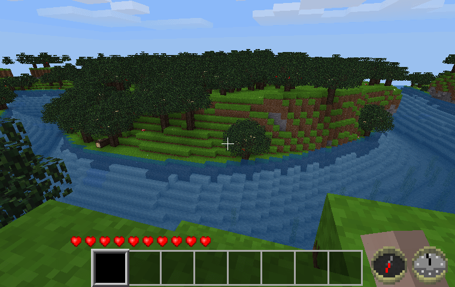

HUD Compass [hud_compass]
-------------------------

A Minetest mod to optionally place a HUD compass and a 24-hour clock on the screen.

By David G (kestral246)

How to enable
-------------

This mod defaults to not displaying a compass or a clock. To enable, use the chat command:

	"/compass" -> By default this places just a compass in the bottom right corner of the screen.

Repeated use of this command will toggle the display of the compass off and on.

When given with an argument, the user can select whether to display just a compass, or a compass and a clock, and which corner of the screen to place them in. This is particularly useful with Android clients, where the bottom right corner of the screen has the jump button.

	"/compass 1" -> compass only, top right corner
	"/compass 2" -> compass only, bottom right corner
	"/compass 3" -> compass only, bottom left corner
	"/compass 4" -> compass only, top left corner
	
	"/compass 5" -> compass and clock, top right corner
	"/compass 6" -> compass and clock, bottom right corner
	"/compass 7" -> compass and clock, bottom left corner
	"/compass 8" -> compass and clock, top left corner

In addition:

	"/compass 0" -> forces compass and clock off.

**Note:** The clock is a 24-hour clock, with only one hand that displays the hours. Noon is at the top and midnight is at the bottom.

**New:** The default initial state can now be set in minetest.conf using "compass\_default\_corner = n", where "n" can be one of the eight corner numbers above. If it's positive, the compass (or compass and clock) will be enabled at start, while if it's negative, they will start disabled.

Local mod storage is used to maintain the state and position of hud_compass display between sessions, per user.

Special Thanks
--------------
Special thanks go out to MoNTE48, for pointing out that the image files could be significantly reduced with zopflipng (much better than with optipng), in this mod's first Pull Request.

Licenses
--------
Source code

> The MIT License (MIT)

Media (textures)

> Attribution-ShareAlike 3.0 Unported (CC BY-SA 3.0)

> (Compass textures were copied from my realcompass mod, which were originally based on the textures created by tacotexmex for the ccompass mod. Clock textures were derived from these same textures.)

