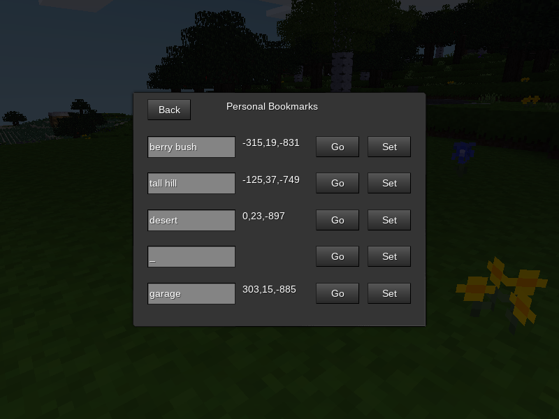

## Personal Bookmarks


### Description:

A [Minetest][] mod that allows players to create a limited number of personal bookmarks to where they can teleport.



### Licensing:

- Code: [MIT](LICENSE.txt)
- Textures: CC0
- Icon: [CC0](https://openclipart.org/detail/266815)

### Usage:

```
- open inventory
- select "More" tab
- select "Personal Bookmarks"
- input a description into text field
- press "Set" to store location
- press "Go" to teleport to location
```

#### Settings:

```
- pbmarks.max
  - number of allowed bookmarks
  - type:    int
  - min:     1
  - max:     5
  - default: 5

- pbmarks.disallow_protected
  - don't allow bookmarks to be set in areas not accessible to player (requires protection mod, currently only simple_protection supported)
  - type:    bool
  - default: true
```

### Requirements:

- Depends: [wdata](https://content.minetest.net/packages/AntumDeluge/wdata/), [sfinv_buttons](https://content.minetest.net/packages/Wuzzy/sfinv_buttons/)
- Optional depends: [simple_protection](https://content.minetest.net/packages/Krock/simple_protection/)

### Links:

- [](https://content.minetest.net/packages/AntumDeluge/pbmarks/)
- [Forum](https://forum.minetest.net/viewtopic.php?t=26805)
- [Git repo](https://github.com/AntumMT/mod-pbmarks)
- [API](https://antummt.github.io/mod-pbmarks/docs/api.html)
- [Changelog](changelog.txt)
- [TODO](TODO.txt)


[Minetest]: http://minetest.net/
